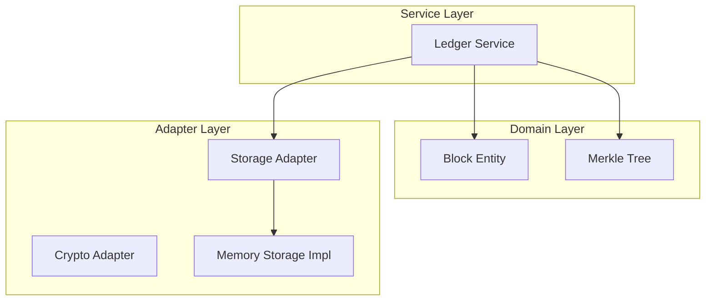

# Blockchain Supply Chain Integrity

## Architecture

### Layers

1.  **Domain**: Core business logic (Block, Merkle Tree).
2.  **Services**: Orchestrates operations (Ledger validation, block creation).
3.  **Adapters**: External interfaces (Storage, Cryptography).
